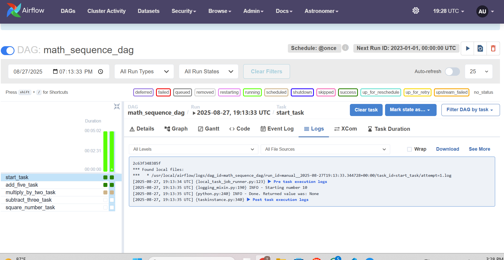
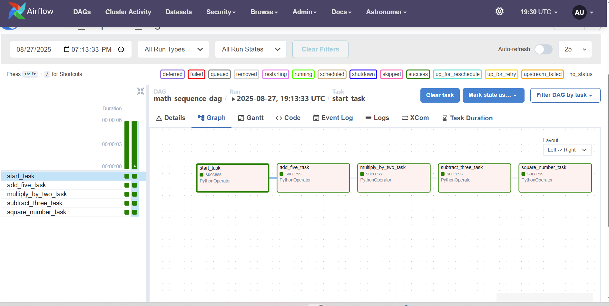

# 🚀 Airflow Astro Project

This project is an **Apache Airflow DAG collection** built with [Astronomer Astro CLI](https://www.astronomer.io/). It demonstrates ETL workflows, task orchestration, and Python-based data pipelines in a containerized Airflow environment.

## 📂 Project Structure
.
├── dags/
│   ├── exampledag.py        # Sample DAG
│   ├── maths_operation.py   # DAG with math sequence tasks
│   ├── mlpipeline.py        # Machine Learning pipeline DAG
│   └── taskflowapi.py       # TaskFlow API example
├── include/                 # (Optional) helper scripts
├── plugins/                 # (Optional) Airflow plugins
├── tests/                   # DAG/unit tests
├── Dockerfile               # Astro runtime build
├── packages.txt             # System dependencies
├── requirements.txt         # Python dependencies
├── airflow_settings.yaml    # Airflow connections/variables
└── .astro/config.yaml       # Astro project config

## ⚙️ Setup & Run
### 🔑 Prerequisites
- [Docker Desktop](https://www.docker.com/products/docker-desktop)  
- [Astro CLI](https://www.astronomer.io/docs/astro/cli/install-cli)  

### ▶️ Start Airflow
Run the following command:

    astro dev start

Airflow UI → [http://localhost:8080](http://localhost:8080) (Default login: `admin` / `admin`)

### ⏹️ Stop Airflow
    astro dev stop

## 📊 DAGs Included

| DAG File             | Description                                                                 |
|-----------------------|-----------------------------------------------------------------------------|
| `exampledag.py`       | Example DAG from Astronomer showing TaskFlow API and dynamic task mapping. |
| `maths_operation.py`  | Demonstrates a math sequence DAG with dependencies.                        |
| `mlpipeline.py`       | Illustrates a simple ML pipeline with preprocessing & training.            |
| `taskflowapi.py`      | Example DAG using TaskFlow API with `@task` decorators.                    |

## 🖼️ Screenshots
👉 

## 👨‍💻 Author
**Tarun Peela**  
📍 Tampa, FL | Data Engineer / Data Scientist  
📧 tarunpeela0@gmail.com    
🔗 [GitHub](https://github.com/TarunVirat)  